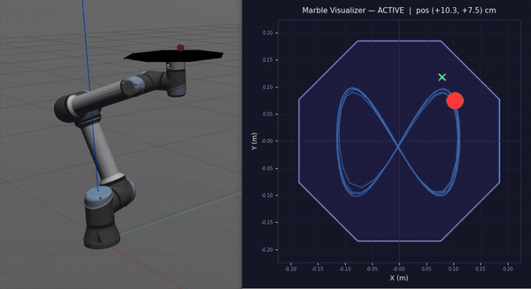
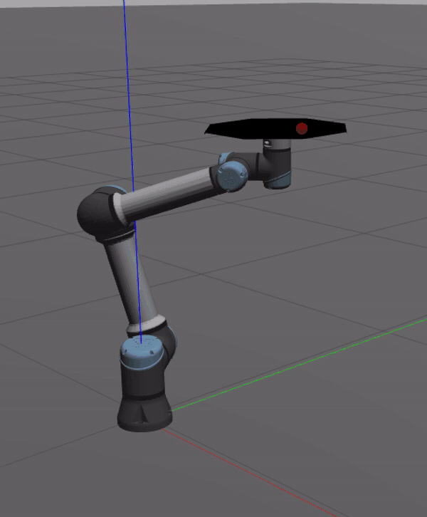
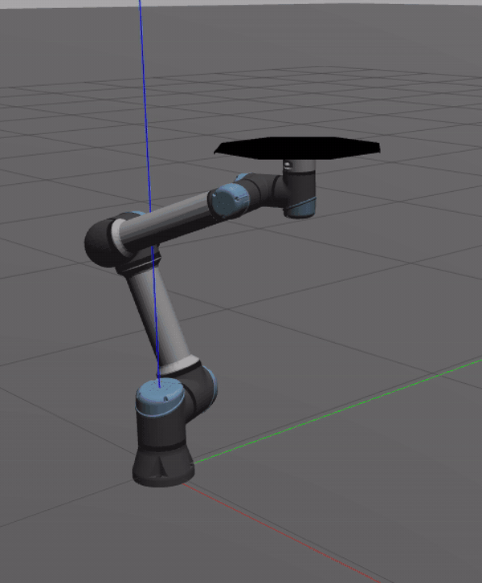
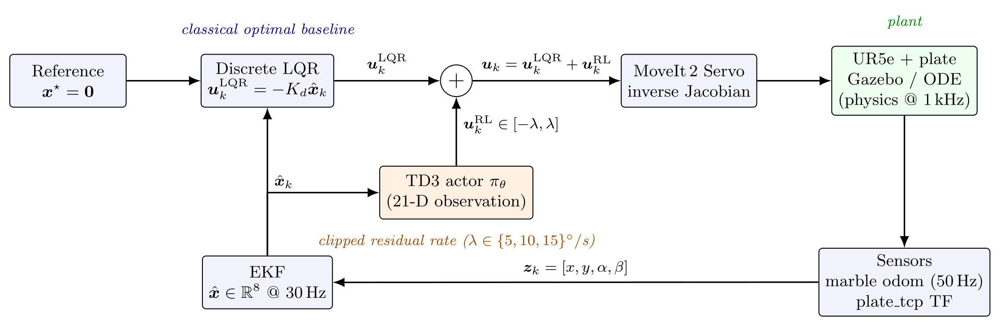

# Hybrid Optimal + Residual RL Control for 6-DOF Ball-and-Plate Stabilization

<p align="center">
  
  
  
  
  
  
  
</p>

A real-time hybrid controller that stabilises a free-rolling spherical marble on the end-effector plate of a UR5e 6-DOF manipulator. A discrete-time **Linear Quadratic Regulator** synthesised on an 8-state ball-plate-actuator model provides a model-based optimal baseline; a **Twin Delayed Deep Deterministic Policy Gradient (TD3)** agent operating on a 21-D augmented observation produces a residual angular-rate correction that is summed onto the LQR command. The system runs at 30 Hz in ROS 2 Humble / Gazebo Classic with MoveIt 2 Servo for inverse-Jacobian execution, an Extended Kalman Filter on the full nonlinear ball-plate Lagrangian for state estimation, and a survival-gated authority curriculum during training.

<p align="center">
  <a href="50_Documetation/Hybrid_Optimal_Residual_RL_Ball_Plate.pdf">
    
  </a>
</p>

---

## Demos

<p align="center">
<table>
  <tr>
    <td colspan="2" align="center">
      <br/>
      <b>LQR baseline</b><br/>Marble Lissajous tracking with the optimal LQR alone.
    </td>
  </tr>
  
  <tr>
    <td align="center" width="50%">
      <br/>
      <b>Hybrid (LQR + TD3 residual)</b><br/>Same Lissajous trajectory; residual reshapes the closed-loop response.
    </td>
    <td align="center" width="50%">
      <br/>
      <b>Hybrid under TCP jitter</b><br/>Hybrid controller rejecting band-limited TCP-velocity jitter while the marble holds centre.
    </td>
  </tr>
</table>
</p>

## System Architecture

<p align="center">
  
  <br>
  <em><b>Figure 1:</b> Hybrid control architecture. The EKF fuses the 50 Hz marble odometry and plant TF to feed both the classical optimal baseline (blue) and the learned residual actor (orange).</em>
</p>

### Key nodes

| Node | Purpose |
|------|---------|
| `marble_servo_controller` | 30 Hz LQR controller + EKF state estimator + residual summation |
| `mux_controller` | Priority mux: manual overrides LQR, reverts after 0.5 s timeout |
| `go_to_pose` | Homes the arm to the flat balanced pose (direct joint-space command) |
| `marble_spawner` | Spawns the marble above the plate centre via TF lookup |
| `marble_spawner_xy` | Spawns the marble at a user-specified plate-frame `(x, y)` offset (capped at 0.18 m) |
| `marble_visualizer` | Live 2D window: marble trail, plate boundary, setpoint, tracking error |
| `marble_plotter` | CSV logging + post-run plot generation |
| `tcp_lissajous_node` | Drives the TCP along a 3-D Lissajous trajectory while balancing |
| `tcp_keyboard_node` | WASD / arrow-key TCP control during balancing |
| `rl_residual_node` | Loads a trained TD3 policy, emits residual rate corrections to the LQR sum |

---

## Tech stack

| Component | Choice |
|-----------|--------|
| Robot model | UR5e (6-DOF), `ur_description` xacro |
| Simulation | Gazebo Classic 11, ODE physics, fixed time-step 1 ms, RT-factor 1.0 |
| Middleware | ROS 2 Humble |
| Motion control | MoveIt 2 Servo (Cartesian twist → joint velocities via inverse Jacobian) |
| Optimal control | Discrete-time LQR (`scipy.linalg.solve_discrete_are`), ZOH discretisation via matrix exponential |
| State estimation | Extended Kalman Filter on 8-D nonlinear Lagrangian, RK4 propagation, Euler-linearised covariance |
| RL framework | Stable-Baselines3 v2.0, Gymnasium env wrapping the live Gazebo loop |
| RL algorithm | TD3 (twin clipped critics, target-policy smoothing, delayed actor updates) |
| Logging | TensorBoard, custom Matplotlib plotter with CSV export |

---

## How it works

### Plant model and LQR baseline

The 8-D state captures the coupled ball-plate dynamics and the manipulator's first-order servo lag:

```
x = [x_ball, vx, y_ball, vy, α, ω_α, β, ω_β]ᵀ ∈ ℝ⁸
```

Linearised at the operating point (small angles, near plate centre), the marble accelerations collapse to `ẍ = −C·β`, `ÿ = −C·α` with `C = m_b · g / (m_b + I_b/r_b²) = 5g/7 ≈ 7.0 m/s²` for a homogeneous solid sphere. The manipulator's velocity-command response is identified as a single-pole PT₁ lag,

```
ω̇_α = (ω^c_α − ω_α) / τ ,    τ = 0.35 s
```

with `τ` measured by a step-response identification on the simulated UR5e + MoveIt 2 Servo + joint-PD chain at the start of the project. Including this lag as augmented states is what lets the LQR anticipate end-effector latency instead of fighting it.

The continuous LTI system is sampled at `T_s = 1/30 s` via zero-order hold, and the optimal feedback `u = −K_d · x̂` is computed by solving the Discrete Algebraic Riccati Equation off-line:

```
Q = diag([100, 100, 200, 200, 5, 1, 5, 1])
       [ x   vx   y   vy  α  ω_α  β  ω_β]
R = 2.0 · I₂
```

The asymmetric `Q_y = 2 · Q_x` reflects that the Lissajous TCP disturbance excites the y-axis at twice the x-axis frequency.

### Extended Kalman filter

Marble odometry provides `(x, y)` at 50 Hz; plate orientation is reconstructed at the joint-state rate from forward kinematics. Neither stream gives velocity directly. Naive numerical differentiation (i) amplifies quantisation noise as `O(1/T_s)`, (ii) reacts badly to brief contact-loss frames, and (iii) is one sample period behind the actual rate by construction. The EKF therefore propagates the **full nonlinear Lagrangian** with RK4, linearises the covariance with an analytical Jacobian, and consumes the same direct measurements `[x, y, α, β]` through a linear `H` matrix:

```
ẍ = (m_b·x·ω_α² + m_b·y·ω_α·ω_β − m_b·g·sin α) / (m_b + I_b/r_b²)
ÿ = (m_b·y·ω_β² + m_b·x·ω_α·ω_β − m_b·g·sin β) / (m_b + I_b/r_b²)
```

Process noise (the main tuning knob) is concentrated on the angular-rate states (`Q[ω_α, ω_β] = 4 · 10⁻²`) to absorb residual error of the PT₁ approximation; measurement noise is `R = 10⁻¹⁰ · I₄` for the simulated ground-truth odometry and is intended to be raised by 7-8 orders of magnitude on real hardware with camera-based marble tracking.

### Residual TD3 + authority curriculum

The hybrid command is the per-axis sum of the LQR baseline and a learned angular-rate residual, clipped to the manipulator's joint-velocity saturation bound:

```
u_k = clip( −K_d · x̂_k + λ · tanh(π_θ(o_k)) ,  ±ω_max )
```

The actor `π_θ : ℝ²¹ → ℝ²` consumes a 21-D observation (8-D state, 2-D target, 3-step position history, windowed TCP linear velocity) and emits a `tanh`-bounded residual that is scaled by the per-stage rate budget `λ`. The training curriculum widens `λ` based on a rolling 20-episode survival fraction:

| Stage | `λ` (per-axis residual rate) | Advance trigger |
|-------|------------------------------|-----------------|
| 0 | ±5 °/s | survival > 30 % over last 20 episodes |
| 1 | ±10 °/s | survival > 55 % over last 20 episodes |
| 2 | ±15 °/s | (terminal stage) |

The transition between stages is a step change in `λ`. The paper documents a **Curriculum Shock** failure mode at the Stage 1 → Stage 2 transition (≈ 613 k training steps) in which the abrupt 50 % widening of the action-bounding ball drives the off-policy TD3 critic outside its training support, triggering an irreversible value-estimate divergence; mitigation via continuous interpolation of `λ` and replay-buffer hygiene at transition time is concrete future work.

### Reward shaping

```
r_k = −k_p ‖p_b‖²  −  k_v ‖ṗ_b‖²  −  k_t (α² + β²)  −  k_s ‖Δu_RL‖²  +  r_survive · 𝟙[alive]
```

Position-dominant, symmetric in the plate frame, with a tilt-magnitude penalty (`k_t = 0.2`), an action-smoothness penalty, and a per-step survival bonus (`r_survive = 0.10`).

---

## Build

```bash
cd Marble_Balancing_Robotic_Arm/40_Simulation/ros2_ws
source /opt/ros/humble/setup.bash
colcon build --symlink-install
source install/setup.bash
```

### Requirements

- ROS 2 Humble
- MoveIt 2 (`moveit_ros`, `moveit_servo`)
- Gazebo Classic (`gazebo_ros_pkgs`)
- `ur_description`, `ur_simulation_gazebo`, `ur_moveit_config`
- Python 3.10: `numpy`, `scipy`, `pyyaml`

For RL training:

```bash
pip install gymnasium "stable-baselines3[extra]" tensorboard
```

For keyboard TCP control:

```bash
pip install pynput
```

---

## Run

### Pure LQR baseline

```bash
ros2 launch marble_balancer servo_balancer.launch.py
```

### Hybrid (LQR + trained TD3 residual)

```bash
ros2 launch marble_balancer servo_balancer.launch.py \
  rl:=true \
  rl_model:=$(pwd)/src/marble_balancer/rl_training/models_td3_v2/best_model_td3_v2.zip \
  rl_norm:=$(pwd)/src/marble_balancer/rl_training/models_td3_v2/running_stats_v2.pkl \
  rl_stage:=2
```

### With trajectory tracking and live plotting

```bash
# Marble figure-eight setpoint
ros2 launch marble_balancer servo_balancer.launch.py lissajous:=true plot:=true

# 3-D TCP Lissajous disturbance during balancing
ros2 launch marble_balancer servo_balancer.launch.py tcp_lissajous:=true plot:=true

# Step-response 4-corner pattern (LQR tuning)
ros2 launch marble_balancer servo_balancer.launch.py square:=true plot:=true
```

### Spawn the marble at a specific plate-frame offset

```bash
ros2 launch marble_balancer spawn_xy.launch.py x:=0.10 y:=0.0
```

### Headless mode (no GUI, ~3× faster)

```bash
ros2 launch marble_balancer servo_balancer.launch.py gui:=false
```

### Manual TCP control

```bash
ros2 launch marble_balancer servo_balancer.launch.py tcp_keyboard:=true
```

| Key | Action |
|-----|--------|
| W / ↑ | TCP +X | 
| S / ↓ | TCP −X |
| A / ← | TCP +Y |
| D / → | TCP −Y |
| R / F | TCP +Z / −Z |
| SPACE | Hard brake (all axes) |
| Q / ESC | Quit node |

Holding a key accelerates at 0.25 m/s²; releasing decelerates at 0.50 m/s².

---

## Train the residual

The full 1-million-step training run that produced the checkpoints used in the paper:

```bash
ros2 launch marble_balancer rl_training.launch.py \
  gui:=false \
  timesteps:=1000000 \
  tcp_lissajous:=true \
  spawn_radius:=0.12
```

Resume from a checkpoint:

```bash
ros2 launch marble_balancer rl_training.launch.py \
  gui:=false \
  timesteps:=1000000 \
  load:=$(pwd)/src/marble_balancer/rl_training/models_td3_v2/best_model_td3_v2.zip \
  tcp_lissajous:=true \
  spawn_radius:=0.12
```

Monitor:

```bash
tensorboard --logdir src/marble_balancer/rl_training/tensorboard_td3_v2/
# http://localhost:6006
```

### Training arguments

| Argument | Default | Description |
|----------|---------|-------------|
| `timesteps` | 500000 | Total training steps |
| `stage` | 0 | Starting curriculum stage (0–2) |
| `seed_steps` | 20000 | RLPD-style buffer pre-seeding before policy updates |
| `load` | _empty_ | Path to a `.zip` checkpoint to resume |
| `tcp_lissajous` | false | Enable 3-D TCP Lissajous disturbance during 50 % of episodes |
| `spawn_radius` | 0.0 | Random marble spawn radius in metres (0 = centre, capped at 0.18) |
| `gui` | true | Gazebo GUI (`false` for headless / fast training) |

### TD3 hyperparameters

| | |
|--|--|
| Replay buffer | 10⁶ transitions |
| Batch size | 256 |
| Actor / critic learning rate | 3 × 10⁻⁴ |
| Discount γ | 0.99 |
| Soft update ρ | 5 × 10⁻³ |
| Target smoothing σ | 0.2 (clipped at 0.5) |
| Exploration σ | 0.1 |
| Policy delay `d` | 2 |
| Actor / critic MLPs | [256, 256] |

---

## Repository layout

```
Marble_Balancing_Robotic_Arm/
├── README.md                            ← This file
├── 10_Model/                            ← CAD models, robot datasheet
├── 30_Literature/                       ← Reference papers
├── 40_Simulation/
│   └── ros2_ws/src/marble_balancer/
│       ├── marble_balancer/             ← Python ROS 2 nodes
│       │   ├── lqr_math.py              ← LQR synthesis (DARE, ZOH discretisation)
│       │   ├── marble_ekf.py            ← 8-D EKF on nonlinear Lagrangian
│       │   ├── marble_servo_controller  ← Main 30 Hz LQR + EKF + residual loop
│       │   ├── mux_controller.py        ← Manual / auto priority mux
│       │   ├── rl_residual_node.py      ← TD3 policy inference for deployment
│       │   ├── tcp_lissajous_node.py    ← 3-D TCP disturbance generator
│       │   └── ...                      ← Trajectory and visualisation nodes
│       ├── rl_training/                 ← Training environment + scripts
│       │   ├── gazebo_rl_env_v2.py      ← Gymnasium env wrapping live Gazebo
│       │   └── train_td3_gazebo_v2.py   ← TD3 trainer + curriculum callback
│       ├── launch/                      ← ROS 2 launch files
│       ├── config/                      ← LQR weights, Servo params, joint limits
│       └── urdf/                        ← UR5e + octagonal plate URDF, marble SDF
└── 50_Documetation/
    ├── Hybrid_Optimal_Residual_RL_Ball_Plate.pdf   ← Conference paper
    ├── Hybrid_Optimal_Residual_RL_Ball_Plate.tex
    ├── references.bib
    ├── figures/                         ← Paper figures (matplotlib + TikZ source)
    └── videos/                          ← Demo recordings (.mov + generated .gif)
```

---

## Key design decisions

| Decision | Rationale |
|----------|-----------|
| **MoveIt 2 Servo** Cartesian-twist commands | Smooth, rate-limited end-effector control via inverse Jacobian; avoids joint-space discontinuities |
| **`plate_tcp` command frame** | Prevents wrist spin; rotation axes stay aligned with the plate surface |
| **PT₁ lag in the LQR plant model** | Captures the empirically identified `τ = 0.35 s` end-effector response; lets the LQR anticipate latency |
| **EKF with full nonlinear Lagrangian** | Hardware-ready estimator; transparent in Gazebo (`R ≈ 0`), filters camera noise at deployment |
| **`Q_y = 2 · Q_x` asymmetry** | The Lissajous TCP disturbance drives the y-axis at 2× the x-axis frequency (~4× kinetic excitation) |
| **Residual scaled, not displaced LQR** | Classical baseline owns stability margin; residual reshapes only what the model misses |
| **Three-stage authority curriculum** | Lets the residual learn under tight authority before being trusted with wider action bounds |
| **Direct joint-space homing** | Inverse-kinematics returned wrong wrist orientations; hardcoded joint angles guarantee a flat plate |

---

## Results

Detailed evaluation, methodology, and discussion are in the [paper](50_Documetation/Hybrid_Optimal_Residual_RL_Ball_Plate.pdf). Two paired test scenarios, 10 deterministic seeds each, comparing the LQR baseline against the Hybrid controller at the 200 k-step checkpoint.

| Scenario | Disturbance | Spawn radius |
|----------|-------------|--------------|
| **1** — nominal | 3-D Lissajous TCP | 0.12 m |
| **2** — extreme | 3-D Lissajous TCP + band-limited TCP-velocity jitter | 0.18 m (≈ plate edge) |

Win-rate is the **reward-superiority win-rate**: the percentage of paired seeds in which a controller's cumulative episode reward exceeds the other's. The two controllers' win-rates are complementary by construction (no ties observed).

| Metric | Direction | LQR (S1) | Hybrid (S1) | LQR (S2) | Hybrid (S2) |
|--------|-----------|---------:|------------:|---------:|------------:|
| Mean total reward | higher better | **+711.99** | +690.81 | **+823.68** | +778.91 |
| RMSE (m) | lower better | 0.1920 | **0.1898** | 0.2587 | **0.2556** |
| Max peak error (m) | lower better | **0.3858** | 0.4098 | 0.6923 | **0.6379** |
| Reward-superiority win-rate | higher better | 40 % | **60 %** | **70 %** | 30 % |

Headline reading: in the nominal scenario the hybrid controller wins the head-to-head on **6 of 10 paired seeds** while improving tracking RMSE by 1.1 % at one third of the LQR's tilt authority. In the extreme-edge scenario the residual cedes the head-to-head (3 / 10) because the LQR alone is sufficient to saturate-rescue the marble in a regime the residual was not trained near; the residual still lowers RMSE by 1.2 % on the seeds where the marble survives, indicating that its added control variance pulls successful trajectories closer to centre but widens the seed-to-seed reward distribution.

The paper documents the **operational envelope** in which the residual helps (and where it does not), the **Curriculum Shock** divergence at the Stage 1 → Stage 2 transition, and a planned friction-coefficient sweep.

---

## Future work

- **Hardware transfer** — UR5e deployment with camera-based marble tracking; raise EKF measurement noise to match the camera's variance.
- **Continuous authority curriculum** — replace the discrete `λ` step with a logistic ramp `λ(t) = λ⁽ˢ⁾ + (λ⁽ˢ⁺¹⁾ − λ⁽ˢ⁾) · σ((t − t₀) / τ_c)` to eliminate the Curriculum Shock divergence.
- **Replay-buffer hygiene at transitions** — flush off-distribution actions and warm-start the critic before resuming joint actor / critic updates.
- **Latency-aware action smoothing** — second-order filter on `u_RL` to bound closed-loop bandwidth below the ROS 2 / Gazebo round-trip latency.
- **Friction-coefficient sweep** — μ ∈ {0.3, 0.5, 0.6, 0.8, 1.0} on Scenario 1 to validate that the operational envelope generalises across realistic contact regimes.
- **Policy distillation** — compress the trained TD3 actor into a smaller real-time-safe network for hardware inference.

---

## Citation

If you use this work, please cite the paper:

```bibtex
@inproceedings{Gery2026Hybrid,
  title  = {Hybrid Optimal and Residual Reinforcement Learning Controller
            for 6-DOF Ball-and-Plate Stabilization},
  author = {Gery, Phillipp and Mathew, Kevin Biju},
  year   = {2026}
}
```

---

## Authors

**Phillipp Gery** — pgery@purdue.edu  
**Kevin Biju Mathew** — kb@purdue.edu  
College of Engineering, Purdue University

## License

MIT
